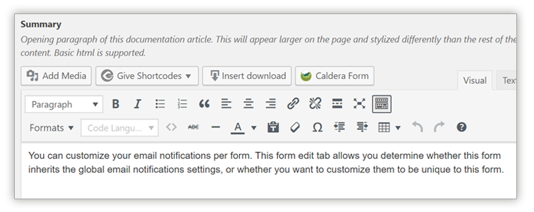
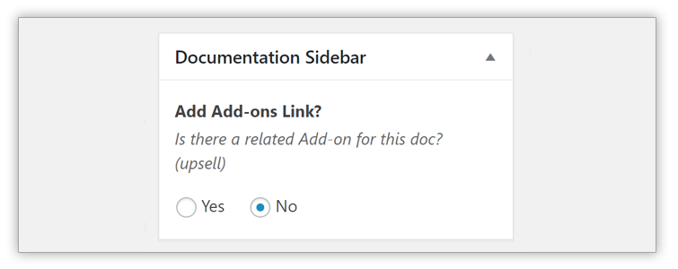
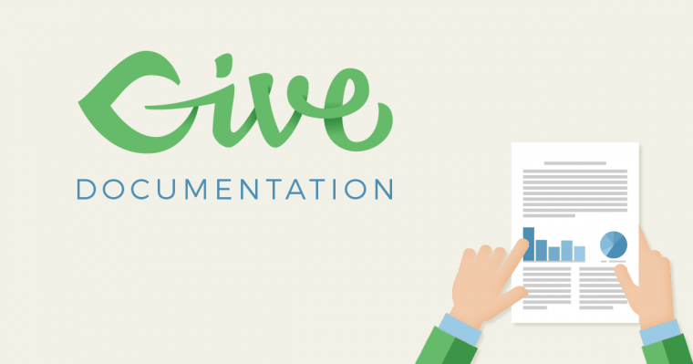

# Writing Online Docs

Writing online documentation is a craft that takes experience and critical feedback. Being able to make technical things clear and understandable in a tone that is empowering for the reader can be challenging.

This article walks through how we approach writing online documentation for our products.

## Goals for All Documentation Articles

There are several important goals for every documentation article that we write.

1. Provide detail for all features of the product
2. Anticipate and answer any questions the reader might have related to the feature in question
3. Provide context to how this feature relates to other features of the product or add-ons
4. Expand the content of our website to further encourage search engines to make our website the authority on all technical matters related to the product

## Documentation Voice
1. Docs do not use first person language such as "our plugin" or "our team."
1. Docs use the same [tone](principles-of-providing-excellent-support/tone-guide.md) as support tickets, that of a wise friend.
1. Docs are designed to be skimmable.

## Composing Docs

All our docs are custom post types built specifically for online documentation purposes. Documentation is a major source of content that greatly improves the search index for our website. Hosting our documentation on our website also ensures that we can build the docs in any way we see fit.

### Summary

The Summary is a quick overview of what the reader should expect to learn from reading this doc. In just 1-2 sentences, the reader should know quickly whether they will find the answer to their question in this doc or not.

The Summary is presented at the very top of every doc in a distinct way to call attention to it.

### Sidebar Metaboxes

When editing/writing a doc, there are several metaboxes found in the sidebar which are important and necessary to display the doc in the appropriate manner.

#### The Page Attributes Metabox

The "Page Attributes" metabox is added by default in WordPress to any custom post type that is hierarchical \(like "Pages", not like "Posts"\). All our docs are hierarchical so that navigation as a reader is an intuitive as possible. The hierarchical navigation structure has clear SEO benefits [over other hosted docs solutions](https://freemius.com/blog/build-knowledge-base-documentation/#not-helpscout).

Setting the correct "Parent" of the doc ensures that the navigation works as intended.

#### Documentation Sidebar

When a documentation article is related to a specific add-on, we want readers to be able to navigate directly from the article to the Add-on product page. Setting this to "Yes" adds the link in the sidebar of the article, like so:

#### Parent Doc

If the article you are writing has child-pages beneath it, it's important to set this option to "Yep". Child pages are output on the frontend near the top of the article in order to invite readers to dig deeper into the documentation.

When this option is set, the child-pages appear near the top of the article like so: 

#### Featured Image

While featured images are very important for SEO and social sharing purposes, they are not strictly necessary for all documentation articles. If a featured image is not selected for an article, there is a default image:

Generally speaking, if the article is related to an add-on, you should choose the add-on product tile image for the featured image. Otherwise, the default image \(meaning, no featured image selected\) works just fine.

### Field options

### Excerpt

### Yoast Options

